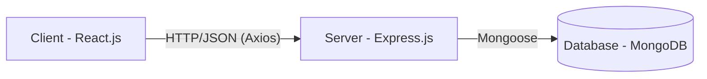

# 🏗️ System Architecture & MVC Pattern

Dokumen ini menjelaskan struktur arsitektur teknis **DOCVIA**. Aplikasi ini dibangun di atas tumpukan (stack) MERN (MongoDB, Express.js, React.js, Node.js) dan mengikuti pola perancangan **Model-View-Controller (MVC)** di sisi backend.

---

## 1. High-Level Architecture (Client-Server)

Aplikasi terbagi menjadi dua lapisan utama yang berdiri secara terpisah (Monolithic decoupling):

1. **Frontend (Client)**: Dibangun dengan Vite + React. Bertugas semata-mata untuk mengelola *User Interface* (UI) dan merender state (View). Berkomunikasi dengan server hanya via REST API.
2. **Backend (Server)**: Dibangun dengan Node.js + Express.js. Bertugas memproses semua logika bisnis, validasi, *routing*, autentikasi (JWT), dan menangani unggahan *file* (Multer).
3. **Database**: MongoDB (NoSQL) menyimpan semua informasi persisten dengan model skema (schema) terstruktur.

---

## 2. Implementasi MVC di Backend

Konsep MVC di dalam project ini diterapkan untuk memastikan bahwa tidak ada satu *file* yang melakukan tugas terlalu banyak, sehingga kode mudah dibaca (maintainability) dan dikembangkan (scalability).

### A. Model Layer (Data Layer)
*Direktori: `server/models/`*

Model bertanggung jawab penuh terhadap struktur data, validasi skema dasar, dan komunikasi langsung dengan MongoDB melalui *Object Data Modeling (ODM)* Mongoose.

- `User.js`: Skema inti untuk identitas login pengguna (password, email, role). Mengandung *hook* khusus untuk mengenkripsi password (`bcrypt`).
- `Doctor.js`: Skema perpanjangan dari `User` untuk menyimpan data medis spesifik dokter (pengalaman, spesialisasi, status approval, ketersediaan). Memiliki *foreign key* `userId` yang merujuk ke tabel `User`.
- `Appointment.js`: Skema transaksional untuk memetakan pasien (`userInfo`) ke dokter (`doctorInfo`), lengkap dengan tanggal, jam, status, dan *file* lampiran medis.
- `Notification.js`: Skema pencatat pesan asinkron dalam aplikasi.

### B. View Layer (Routing Layer)
*Direktori: `server/routes/`*

Dalam arsitektur API murni seperti ini, lapisan *View* bukan berupa HTML/EJS, melainkan **Routing / Endpoint URL**. Rute ini menentukan "kemana permintaan HTTP harus diarahkan".

- Berfungsi menyortir `GET`, `POST`, `PUT`, `DELETE`.
- Menginjeksi keamanan di pintu masuk menggunakan *middleware* (`authMiddleware.js`).
- Contoh: `router.post('/register', register)` — Saat ada request ke `/register`, Rute ini meneruskannya ke fungsi `register` di Controller.

### C. Controller Layer (Logic Layer)
*Direktori: `server/controllers/`*

Controller adalah **otak** di balik setiap request. Ini adalah perantara (middleman) antara View (Routing) dan Model. Semua aturan logika bisnis diletakkan di sini.

- `authController.js`: Memvalidasi kelengkapan form registrasi, mencocokkan hash password, dan menghasilkan *token* JWT.
- `appointmentController.js`: Memastikan bahwa *slot* jam yang dipesan tidak bentrok, memindahkan file dokumen (dari Multer) ke penyimpanan akhir, mengubah status database melalui Model, dan membangkitkan notifikasi otomatis ke dokter.
- `adminController.js`: Menghitung data agregat (statistik dashboard) dari seluruh Model, serta menyetujui lamaran dokter yang mengubah hak akses (`role`) User.

---

## 3. Keamanan & Performa (Security & Performance)

### A. Autentikasi Stateless (JWT)
Kita tidak menggunakan session cookies di server. Setiap kali user *login*, server mencetak sebuah JWT (JSON Web Token) yang memiliki "umur kadaluarsa". 
- Frontend menyimpan JWT ini.
- Untuk setiap *request* yang membutuhkan izin khusus (seperti mem-booking jadwal atau masuk dashboard admin), token ini disisipkan pada header `Authorization: Bearer <token>`.
- `authMiddleware.js` membongkar token ini, dan jika sah, request diizinkan masuk ke Controller. Jika tidak sah/palsu/kadaluarsa, request langsung ditolak (401 Unauthorized) tanpa menyentuh Controller maupun Database.

### B. Skalabilitas Database
- Menggunakan MongoDB yang berbasis dokumen JSON (BSON). Sangat cepat dan fleksibel untuk struktur data berulang seperti *Timings/Availability* dokter yang berbentuk *array of objects*.
- Menggunakan *Indexing* (`doctorSchema.index({ specialization: 1 })`) agar saat ratusan pasien mencari dokter spesialis jantung ("Cardiology") secara bersamaan, proses pencarian di *database* berlangsung instan.

### C. Penanganan Error Terpusat
Untuk menjaga agar server tidak *crash*, semua fungsi di Controller dibungkus blok `try-catch`, dan membuang error (lemparan `next(error)`) ke satu *file* tunggal `server/middleware/errorHandler.js`. Ini memastikan frontend selalu mendapat respons error rapi (berupa JSON) yang seragam.
